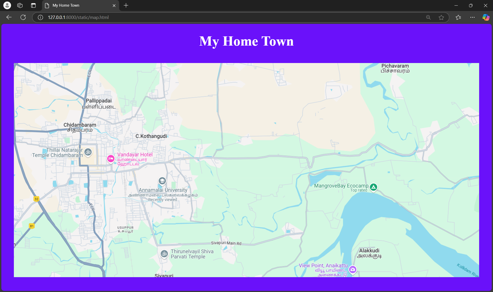
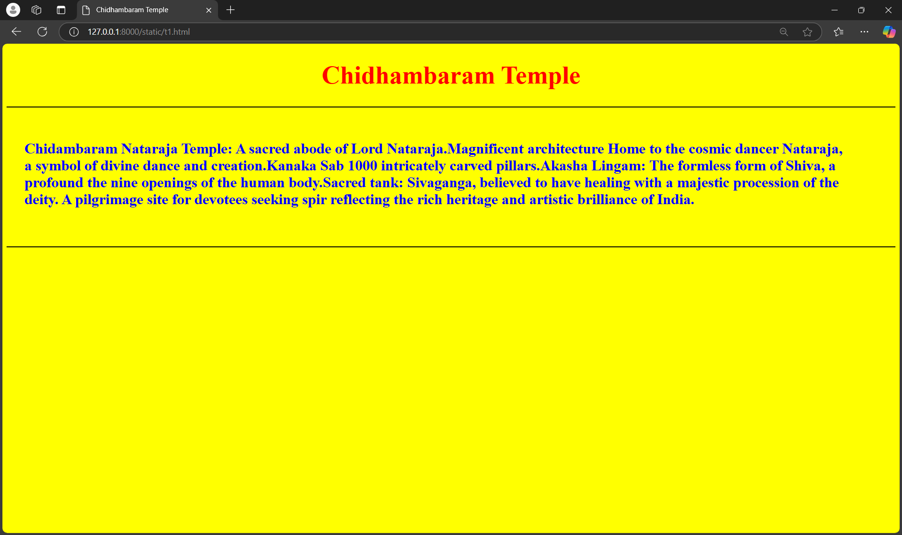
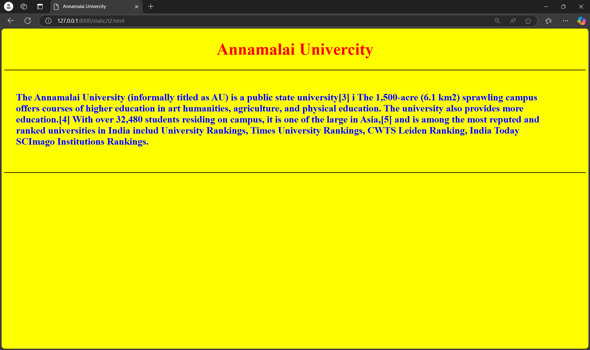
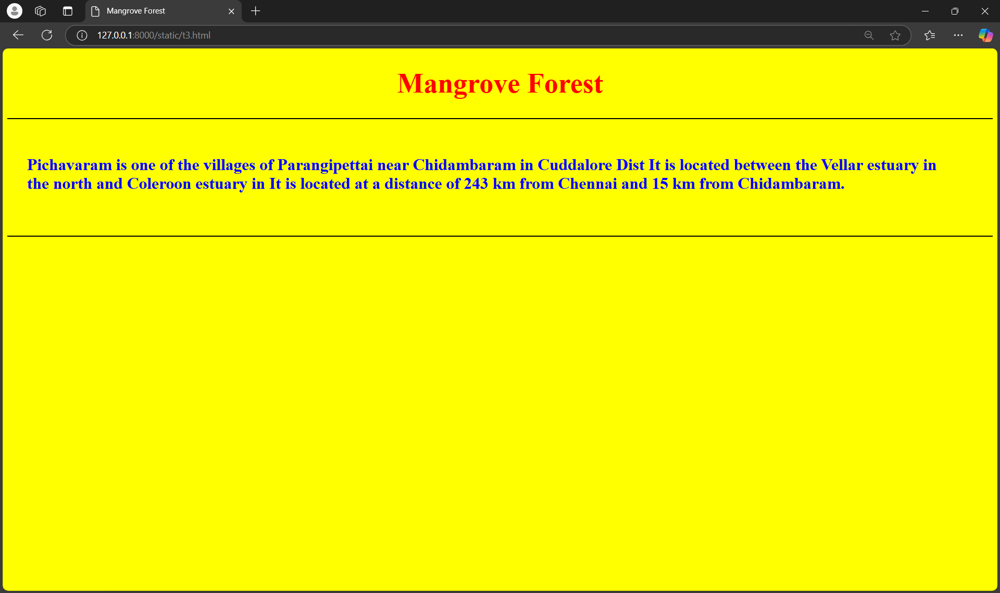

# Ex04 Places Around Me
# Date:05.10.2024
# AIM
To develop a website to display details about the places around my house.

# DESIGN STEPS
## STEP 1
Create a Django admin interface.

## STEP 2
Download your city map from Google.

## STEP 3
Using <map> tag name the map.

## STEP 4
Create clickable regions in the image using <area> tag.

## STEP 5
Write HTML programs for all the regions identified.

## STEP 6
Execute the programs and publish them.

# CODE
```
map.html

<!DOCTYPE html>
 <html lang="en">
 <head>
 <meta charset="UTF-8">
 <meta name="viewport" content="width=device-width, initial-scale=1.0">
 <title>My Home Town</title>
 <style>
 img{
 padding-top: 1%;
 }
 h1{
          text-align: center;
          font-size: 48px;
          color: white;
      }
      body{
          background-color: rgb(106, 17, 250);
      }
  </style>
 </head>
 <body>
  <h1>My Home Town</h1>
  <center></center>
  <map name="image-map">
    <area target="" alt="Chidambaram Temple" title="Chidambaram Temple" href="t1.html" coords="278,348,34,268" shape="rect">
    <area target="" alt="Annamalai University" title="Annamalai University" href="t2.html" coords="368,380,653,510" shape="rect">
    <area target="" alt="Mangroove Forest" title="Mangroove Forest" href="t3.html" coords="997,378,1296,470" shape="rect">
 </map>
 </body>
 </html>

 t1.html

 <!DOCTYPE html>
<html lang="en">
<head>
  <meta charset="UTF-8">
  <meta name="viewport" content="width=device-width, initial-scale=1.0">
  <title>Chidhambaram Temple</title>
  <style>
      h1 {
          color: red;
          text-align: center;
          font-size: 48px;
      }
      p {
          padding-top: 2%;
          font-size: 28px;
          padding-right: 5%;
          padding-left: 2%;
          color: blue;
      }
      body {
          background-color: yellow;
      }
  </style>
</head>
<body>
  <h1>Chidhambaram Temple</h1>
  <hr color="black">
  <p><b>
   Chidambaram Nataraja Temple: A sacred abode of Lord Nataraja.Magnificent architecture
   Home to the cosmic dancer Nataraja, a symbol of divine dance and creation.Kanaka Sab
   1000 intricately carved pillars.Akasha Lingam: The formless form of Shiva, a profound
   the nine openings of the human body.Sacred tank: Sivaganga, believed to have healing 
   with a majestic procession of the deity. A pilgrimage site for devotees seeking spir
   reflecting the rich heritage and artistic brilliance of India.
      </b></p>
  <br><br>
  <hr color="black">
</body>
</html>

t2.html

<!DOCTYPE html>
<html lang="en">
<head>
  <meta charset="UTF-8">
  <meta name="viewport" content="width=device-width, initial-scale=1.0">
  <title>Annamalai Univercity</title>
  <style>
      h1 {
          color: red;
          text-align: center;
          font-size: 48px;
      }
      p {
          padding-top: 2%;
          font-size: 28px;
          padding-right: 5%;
          padding-left: 2%;
          color: blue;
      }
      body {
          background-color: yellow;
      }
  </style>
</head>
<body>
  <h1>Annamalai Univercity</h1>
  <hr color="black">
  <p><b>
   The Annamalai University (informally titled as AU) is a public state university[3] i
    The 1,500-acre (6.1 km2) sprawling campus offers courses of higher education in art
     humanities, agriculture, and physical education. The university also provides more 
      education.[4] With over 32,480 students residing on campus, it is one of the large
       in Asia,[5] and is among the most reputed and ranked universities in India includ
       University Rankings, Times University Rankings, CWTS Leiden Ranking, India Today 
        SCImago Institutions Rankings.
      </b></p>
  <br><br>
  <hr color="black">
</body>
</html>

t3.html

<!DOCTYPE html>
<html lang="en">
<head>
  <meta charset="UTF-8">
  <meta name="viewport" content="width=device-width, initial-scale=1.0">
  <title>Mangrove Forest</title>
  <style>
      h1 {
          color: red;
          text-align: center;
          font-size: 48px;
      }
      p {
          padding-top: 2%;
          font-size: 28px;
          padding-right: 5%;
          padding-left: 2%;
          color: blue;
      }
      body {
          background-color: yellow;
      }
  </style>
</head>
<body>
  <h1>Mangrove Forest</h1>
  <hr color="black">
  <p><b>
   Pichavaram is one of the villages of Parangipettai near Chidambaram in Cuddalore Dist
    It is located between the Vellar estuary in the north and Coleroon estuary in 
    It is located at a distance of 243 km from Chennai and 15 km from Chidambaram.
      </b></p>
  <br><br>
  <hr color="black">
</body>
</html>
```
# OUTPUT




# RESULT
The program for implementing image maps using HTML is executed successfully.
